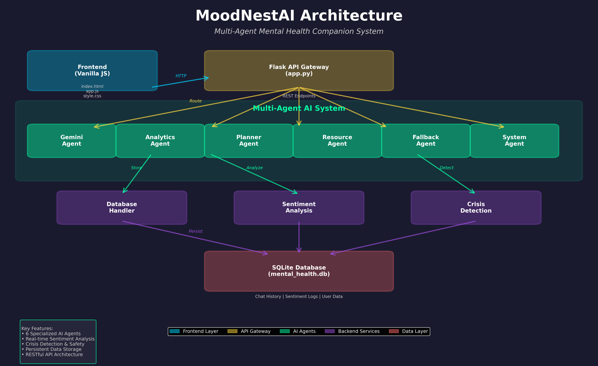

# MoodNestAI 

A comprehensive Mental Health Companion application featuring a multi-agent AI system, sentiment analysis, and real-time analytics. Built with Python/Flask backend and Vanilla JavaScript frontend.
[](https://youtu.be/CrzpF_mzJ6o)


## Architecture Overview



The system follows a multi-layered architecture with a Flask API gateway orchestrating 6 specialized AI agents, backend services for sentiment analysis and crisis detection, and a SQLite database for persistent storage.

## Features

###  Multi-Agent AI System
- **Gemini Agent**: Powered by Google's Generative AI for empathetic conversations
- **Fallback Agent**: Crisis detection and safety responses with helpline information
- **Analytics Agent**: Real-time sentiment analysis using TextBlob
- **Planner Agent**: Personalized daily plans based on time of day
- **Resource Agent**: Context-aware coping strategies and mental health resources
- **System Agent**: Real-time system health monitoring

###  Analytics Dashboard
- **Sentiment Trend Chart**: Line graph tracking mood over time
- **Mood Distribution**: Pie chart showing positive/neutral/negative breakdown
- **Dynamic Insights**: AI-generated feedback based on your emotional patterns
- **Statistics Cards**: Total interactions, average mood, and system status

###  Data Management
- **Persistent Storage**: SQLite database for chat history and sentiment logs
- **Data Export**: Download your complete data as JSON
- **Privacy First**: All data stored locally on your machine

### Premium UI/UX
- **Dark Theme**: Easy on the eyes with glassmorphism effects
- **Responsive Design**: Works seamlessly on desktop and mobile
- **Smooth Animations**: Micro-interactions for enhanced user experience
- **Modern Stack**: Tailwind CSS, Chart.js, and FontAwesome icons

## Quick Start

### Prerequisites
- Python 3.8 or higher
- pip (Python package manager)
```bash
   python --version 
   ```


### Installation

1. **Clone or download the project**
   ```bash
   git clone https://github.com/mayurajh2004/MoodNestAI.git
   ```

2. **Install Python dependencies**
   ```bash
   cd server
   python -m pip install -r requirements.txt
   ```

3. **Configure API Key** (Optional but recommended)
   - Open `server/.env`
   - Replace `YOUR_API_KEY_HERE` with your Google Gemini API key
   - Get your API key from: https://makersuite.google.com/app/apikey

4. **Start the backend server**
   ```bash
   python app.py
   ```
   Server will run on `http://localhost:3000`

5. **Open the frontend**
   - Navigate to `client/index.html`
   - Open it in your web browser
   - Start chatting!

## 📁 Project Structure

```
app/
├── server/                 # Backend (Python/Flask)
│   ├── agents/             # AI Agent modules
│   │   ├── gemini_agent.py
│   │   ├── fallback_agent.py
│   │   ├── analytics_agent.py
│   │   ├── system_agent.py
│   │   ├── planner_agent.py
│   │   └── resource_agent.py
│   ├── app.py             # Main Flask application
│   ├── database.py        # SQLite database handler
│   ├── requirements.txt   # Python dependencies
│   └── .env               # Environment variables
│
└── client/                # Frontend (Vanilla JS)
    ├── index.html         # Main HTML file
    ├── css/
    │   └── style.css      # Custom styles
    └── js/
        └── app.js         # Frontend logic
```

## Configuration

### Environment Variables (`.env`)
```env
PORT=3000
GEMINI_API_KEY=YOUR_API_KEY_HERE
```

### API Endpoints
- `POST /api/chat` - Send a message and get AI response
- `GET /api/analytics` - Retrieve sentiment history
- `GET /api/system` - Get system health metrics
- `GET /api/history` - Fetch chat history
- `POST /api/agent/planner` - Get daily plan
- `POST /api/agent/resource` - Get coping strategies
- `GET /api/export` - Export all user data

## Safety Features

- **Crisis Detection**: Automatically detects crisis keywords and provides helpline information
- **Fallback System**: Graceful degradation when AI is unavailable
- **Data Privacy**: All data stored locally, no external tracking

## Usage Tips

1. **First Time Setup**: Add your Gemini API key for full AI capabilities
2. **Chat Naturally**: The AI is trained to be empathetic and supportive
3. **Use Quick Actions**: Try "Daily Plan" and "Coping Strategy" buttons
4. **Check Analytics**: Monitor your mood trends over time
5. **Export Data**: Download your data anytime from the System page


### Server won't start
- Ensure Python 3.8+ is installed: `python --version`
- Install dependencies: `pip install -r requirements.txt`
- Check if port 3000 is available

### AI responses are generic
- Verify your Gemini API key in `.env`
- Restart the server after updating `.env`
- Check server logs for API errors

### Charts not displaying
- Ensure you have chat history (send a few messages first)
- Check browser console for JavaScript errors
- Refresh the page

## Contributing

This is a personal mental health companion project. Feel free to fork and customize for your own use!

## License

MIT License - feel free to use and modify as needed.

## Mental Health Resources

If you're in crisis, please reach out:
- **National Suicide Prevention Lifeline**: 988 (US)
- **Crisis Text Line**: Text HOME to 741741
- **International Association for Suicide Prevention**: https://www.iasp.info/resources/Crisis_Centres/

---

**Note**: This application is a supportive tool and not a replacement for professional mental health care. If you're experiencing a mental health crisis, please contact a qualified healthcare provider or emergency services.


